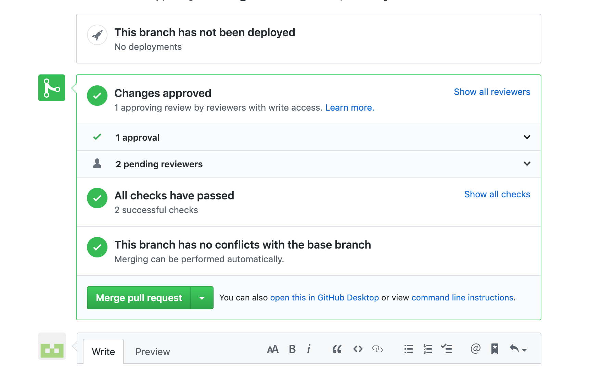

#### Points to note:
- All branch names and image names to be in lower case.
- All names to be hyphen separated.

#### Steps to create a new post in the `pulse` page of the website.
- Create a new branch in the website repo.
  - Click the `Branch` dropdown on the top-left side, enter the name of the branch and click `Create new branch`. The             branch will be created and set as the new branch.
- Create a new file under the branch in the `_posts` folder.
  - Go to the `_posts` folder and click `Create new file`. Enter the name of the post in the format `YYYY-MM-DD-<Name of           the article separated by hyphen>`. For eg: 2013-09-10-Subnero-featured-in-the-Economist.md.
- Layout of the post.
  - The following should be given in the beginning of the file.
```
---
layout: post
title: Subnero expands in China
banner : images/banner-pulse-standard.jpg
date:  2019-10-15
categories: wnc
thumbnail: images/pulse-thumbnail-smartsea.jpg
---
```

    - There should be no spaces before the dashes and there should be one space after the colon.
    - The `title` and `date` are shown below the image for each post in the pulse page.
    - The `categories` section is to link the relevant tags to the post. Currently, we have `media`, `news`, `newsletter`, `sauvc`, `sensors`, `wnc` and `wqm`. If there are multiple categories, the values should be separated with space such as `news wnc`.
    - The `thumbnail` is the image of the post in the https://subnero.com/pulse/. The thumbnail image has of dimension 250 x 250 px and to be added in the `images` folder and named as `pulse-thumbnail-<name of the image>.jpg`
    - The 'banner' is the image of the post in the top of the page in the pulse post. The banner image should be added in the  `images` folder and named as `banner-pulse-<name of the image>.jpg`.
    - It would be good to have images in the post. The image needs to be added in the `images` folder and named as `pulse-<name of the image>.jpg`. The image can be added in the post as shown below.
```
{: .center-image  }
```
    - Any links added to the post should be in markdown format.
```
[Unet handbook](https://unetstack.net/handbook/){:target="_blank"}
```
    - If the pulse article is a direct link to a website, post content will include an `external_url` and `source` instead of `banner` and `date`.
```
---
layout: post
category: news
title: Punchlines
external_url: https://www.straitstimes.com/opinion/cartoons/punchlines-july-17-2018
source : https://www.straitstimes.com/opinion/cartoons
thumbnail: images/pulse-thumbnail-swan-comic.jpg
---
```
    - If there is a reference to our modems/UnetStack/SWAN, it would be good to provide links to the respective page in our website or the UnetStack website.

- Click `Commit new file` at the bottom of the page.
- Create a `Pull request` to add the post to master.
  - Go to `Pull request` tab shown on top of the page. Click `New pull request`, select `Reviewers` from the right-hand side as Manu/Chinmay/Anne and click `Create pull request`.

- The comments from the reviewers can be seen in the `Pull request` and will also be received as mail alerts.
- When there is any commit in this repo, `Travis` checks are triggered automatically to check for broken links in the website.


- Once all the review comments are addressed and the reviewers have approved and if all the `Travis` checks have passed, the branch can be merged to master.

